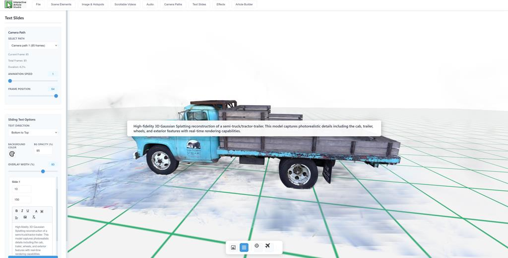
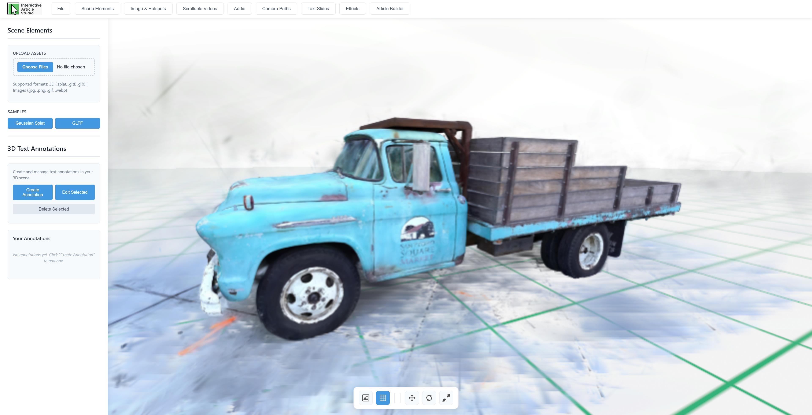
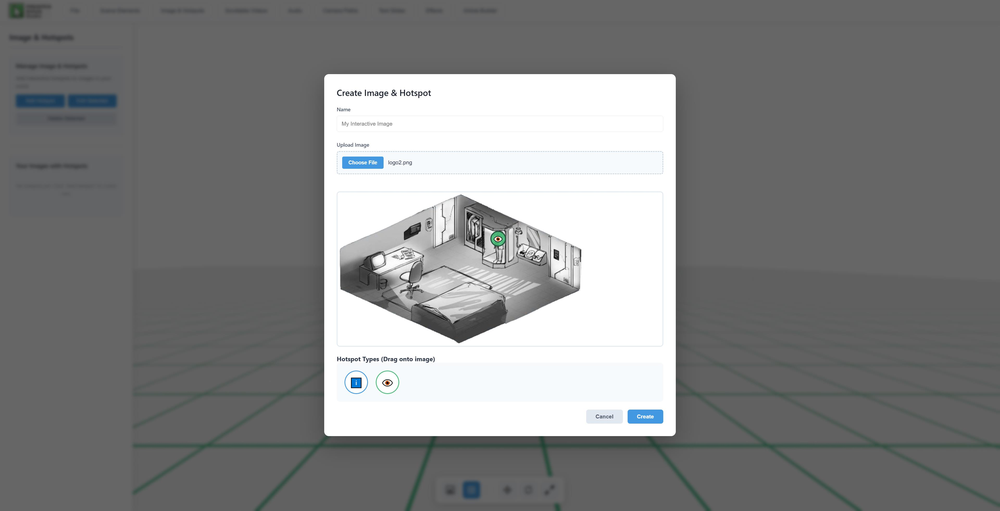
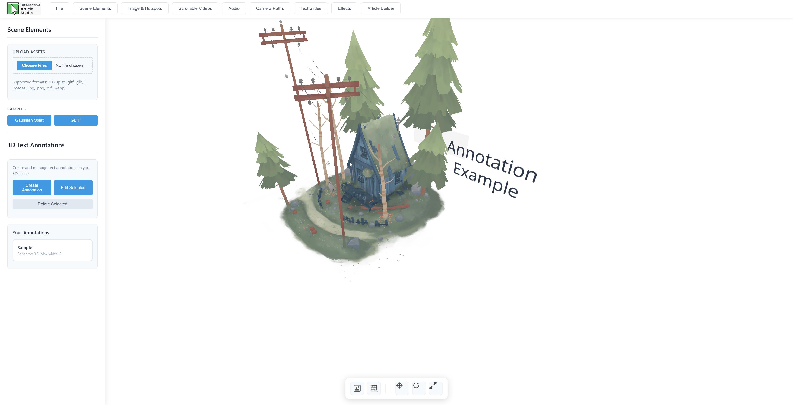
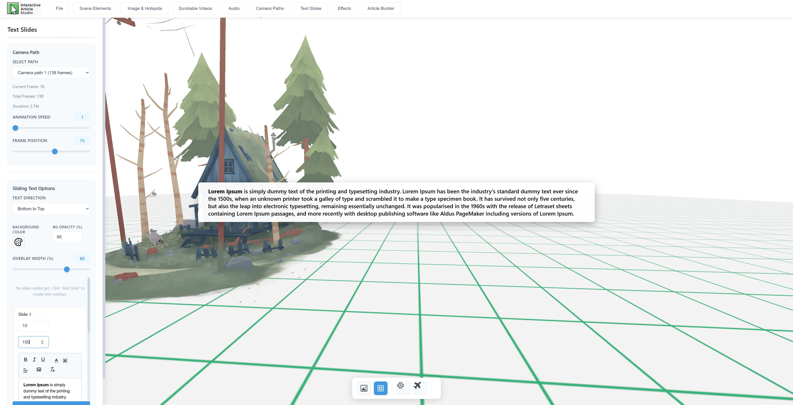
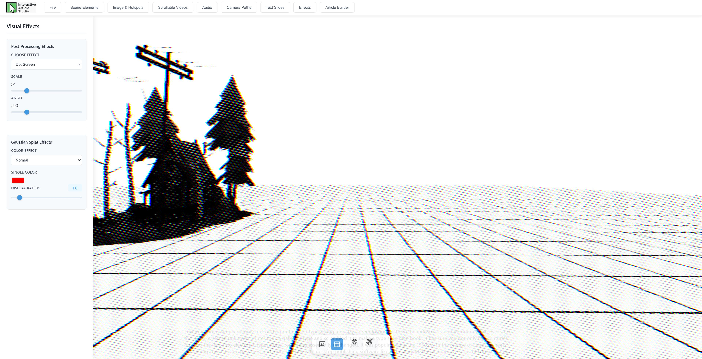
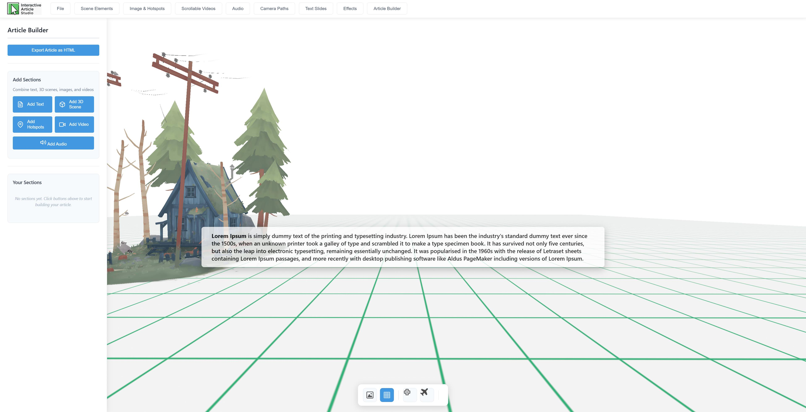

# Interactive Article Studio
<table>
  <tr>
    <td></td>
    <td></td>
  </tr>
  <tr>
    <td></td>
    <td></td>
  </tr>
    <tr>
    <td></td>
    <td></td>
  </tr>
      <tr>
    <td></td>
    
  </tr>
</table>

A powerful web-based and application based (Windows, MacOS) tool for creating immersive, scroll-driven 3D storytelling experiences. Build interactive articles that combine rich text, 3D scenes, camera animations, hotspots, videos, and AI-generated audio.

## Overview

Interactive Article Studio enables creators to build engaging narrative experiences by seamlessly blending traditional article content with interactive 3D elements. The platform. which is available in web and application forms, supports real-time camera path recording, text overlays synchronized with 3D animations, and multimedia integration—all exportable as standalone HTML files.

## Key Features

### 3D Scene Management
- **Asset Support**: Import and manage 3D models (GLTF, GLB), Gaussian Splats (.splat) and images
- **Visual Effects**: Built-in post-processing effects including bloom, glitch, halftone, and more
- **Scene Editor**: Intuitive transform controls (translate, rotate, scale) with visual grid system
- **Background Customization**: Dynamic sky color and environment settings

### Camera Animation System
- **Live Recording**: Record camera movements in real-time with frame-perfect capture
- **Keyframe Editor**: Manually place camera positions and create interpolated paths
- **Path Management**: Save, load, and organize multiple camera animations
- **Smooth Playback**: 60fps interpolation for cinematic camera movements

### Scrollytelling Engine
- **Text Overlays**: Rich text editor (Quill.js) with formatting, colors, and image support
- **Synchronized Animations**: Link text slides to specific camera path frames
- **Multiple Directions**: Configurable text entrance animations (bottom-to-top, left-to-right, etc.)
- **Customizable Styling**: Adjustable background colors, opacity, and overlay width

### Image Hotspots
- **Image Integration**: Upload images and add hotspots
- **Hotspot Types**:
  - **Info (ℹ️)**: Display text information on click
  - **Eye (👁️)**: Show detailed images with descriptions
- **Visual Editor**: Drag-and-drop hotspot placement on uploaded images

### Scroll-Driven Video
- **Scroll-based video**: Videos play frame-by-frame based on scroll
- **Multiple Formats**: Support for MP4, WebM, and OGG

### AI-Powered Audio
- **Text-to-Speech**: Integrated Kokoro TTS engine for natural voice synthesis
- **Multiple Voices**: 10+ English voices (US and UK accents)
- **Quality Options**: Multiple precision levels (FP32, FP16, Q8, Q4) for speed and accuracy
- **Audio Management**: Save and reuse generated audio clips

### Article Builder
- **Section Types**:
  - **Text Sections**: Rich formatted content with customizable backgrounds
  - **3D Sections**: Embedded camera animations with optional text overlays
  - **Hotspot Sections**: Interactive image experiences
  - **Video Sections**: Scroll-controlled video playback
  - **Audio Sections**: Embedded audio players with transcripts
- **Drag-to-Reorder**: Flexible section organization
- **HTML Export**: Complete standalone interactive articles generator with embedded assets

## Technology Stack

### Frontend
- **A-Frame**: Framework for 3D scene rendering
- **Three.js**: Underlying 3D graphics library
- **Quill.js**: WYSIWYG rich text editor
- **Custom Components**: Specialized A-Frame components for camera recording, scroll animation, video control, etc

### Backend
- **Node.js + Express**: Server logic
- **SQLite3**: Lightweight project database for saving projects
- **Kokoro.js**: text-to-speech AI model

## Export System
The export system creates standalone HTML files with:
- Embedded 3D scenes with all assets
- Scroll-driven camera animations
- Text overlay system with transitions
- Interactive hotspot functionality
- Frame-accurate video scrubbing
- All custom A-Frame components inlined
- Self-contained with no external dependencies

## Requirements
- Modern web browser with WebGL 2.0 support if running web version
- Minimum 4GB RAM (for TTS model loading)

## Browser Compatibility (web version)
- Chrome/Edge 90+
- Firefox 88+
- Safari 14.1+

## Upcoming changes:
- Add Studio performance options (in File Section) that impacts webGPU load and speed
- Predefined camera paths selector
- AI powered short video generation (Grok?)
- Project autosave and options
- Implement the ability to load/import a spreadsheet containing text, frame number, and duration for how long the scrollable text remains visible in frames
- Add possibility to make change of slides based on click event (clicking on a button - left/right - makes camera jump from point A to point B)
- Add Help menu item explaining how to's. Includes: creating tutorials on Gaussian Splat and GTLF files, compression methods, on using the studio + YouTube videos
- Improve UI
- Improve mobile version
- CMS friendly versions of exported html code for WP, Joomla, and others
- Add multilanguage support
- Release MacOS version of the Studio
- Add new HotSpot types to Images & HotSpots
- Add AI povered Text summarization feature (locally hosted + OpenAI API), IN PROGRESS
- Add Infographics section type to Article Builder and respective Infographics section   

## License
MIT

## Documentation
Full documentation coming soon
